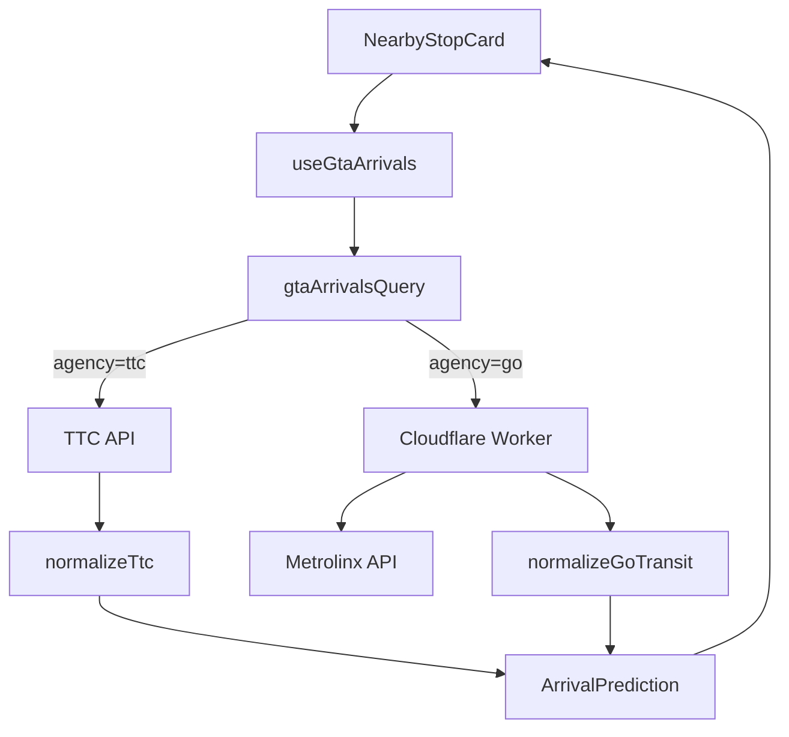

# GTA Unified Architecture - Walkthrough

## Summary

Refactored the TTC transit PWA to support the entire Greater Toronto Area (GTA) with a unified architecture that abstracts away agency-specific details from the UI layer.

## Files Created

| File | Purpose |
|------|---------|
| [unified.ts](file:///Users/kiran/Library/CloudStorage/OneDrive-Personal/Documents/GitHub/gtt/src/models/unified.ts) | [UnifiedStop](file:///Users/kiran/Library/CloudStorage/OneDrive-Personal/Documents/GitHub/gtt/src/models/unified.ts#17-18) type, GO Transit API types, agency display config |
| [gta-proxy.js](file:///Users/kiran/Library/CloudStorage/OneDrive-Personal/Documents/GitHub/gtt/workers/gta-proxy.js) | Cloudflare Worker for Metrolinx API proxy with CORS |
| [gtaStopsDb.ts](file:///Users/kiran/Library/CloudStorage/OneDrive-Personal/Documents/GitHub/gtt/src/store/gtaStopsDb.ts) | Multi-agency IndexedDB store with `agency` index |
| [adapters.ts](file:///Users/kiran/Library/CloudStorage/OneDrive-Personal/Documents/GitHub/gtt/src/components/fetch/adapters.ts) | [normalizeGoTransit()](file:///Users/kiran/Library/CloudStorage/OneDrive-Personal/Documents/GitHub/gtt/src/components/fetch/adapters.ts#11-60) and [normalizeTtc()](file:///Users/kiran/Library/CloudStorage/OneDrive-Personal/Documents/GitHub/gtt/src/components/fetch/adapters.ts#61-115) adapters |

## Files Modified

| File | Changes |
|------|---------|
| [transit.ts](file:///Users/kiran/Library/CloudStorage/OneDrive-Personal/Documents/GitHub/gtt/src/models/transit.ts) | Added `platform` field to [ArrivalPrediction](file:///Users/kiran/Library/CloudStorage/OneDrive-Personal/Documents/GitHub/gtt/src/models/transit.ts#15-24) |
| [queries.ts](file:///Users/kiran/Library/CloudStorage/OneDrive-Personal/Documents/GitHub/gtt/src/components/fetch/queries.ts) | Added [useGtaArrivals()](file:///Users/kiran/Library/CloudStorage/OneDrive-Personal/Documents/GitHub/gtt/src/components/fetch/queries.ts#414-423) hook, [goTransitArrivals()](file:///Users/kiran/Library/CloudStorage/OneDrive-Personal/Documents/GitHub/gtt/src/components/fetch/queries.ts#363-383), [gtaArrivalsQuery()](file:///Users/kiran/Library/CloudStorage/OneDrive-Personal/Documents/GitHub/gtt/src/components/fetch/queries.ts#384-413) |
| [NearbyStopCard.tsx](file:///Users/kiran/Library/CloudStorage/OneDrive-Personal/Documents/GitHub/gtt/src/components/nearby/NearbyStopCard.tsx) | Refactored for unified types, agency badges, ghost/live icons |
| [NearbyStopCard.module.css](file:///Users/kiran/Library/CloudStorage/OneDrive-Personal/Documents/GitHub/gtt/src/components/nearby/NearbyStopCard.module.css) | New styles for unified card layout |
| [wrangler.jsonc](file:///Users/kiran/Library/CloudStorage/OneDrive-Personal/Documents/GitHub/gtt/wrangler.jsonc) | Added `main` entry point for worker |

---

## Architecture Overview



### Key Design Decisions

1. **Ghost Logic**: `isGhost = true` when Metrolinx `Computed === 0` (scheduled only, not live tracked)
2. **Agency Badges**: TTC = red, GO = green (extensible via `AGENCY_CONFIG`)
3. **Backward Compatibility**: [NearbyStopCardLegacy](file:///Users/kiran/Library/CloudStorage/OneDrive-Personal/Documents/GitHub/gtt/src/components/nearby/NearbyStopCard.tsx#144-172) wrapper for existing code

---

## Next Steps

### 1. Fix npm Permissions
```bash
sudo chown -R $(id -u):$(id -g) ~/.npm
npm install
```

### 2. Set Metrolinx API Key
```bash
npx wrangler secret put METROLINX_KEY
```

### 3. Deploy Worker
```bash
npx wrangler deploy
```

### 4. Set Worker URL
Create `.env` file:
```
VITE_GTA_PROXY_URL=https://your-worker.workers.dev
```

### 5. Load GO Stop Data
You'll need to populate the IndexedDB with GO Transit stops using [saveStops()](file:///Users/kiran/Library/CloudStorage/OneDrive-Personal/Documents/GitHub/gtt/src/store/gtaStopsDb.ts#87-109) from [gtaStopsDb.ts](file:///Users/kiran/Library/CloudStorage/OneDrive-Personal/Documents/GitHub/gtt/src/store/gtaStopsDb.ts).

---

## Testing Checklist

- [ ] `npm run build` completes without errors
- [ ] `npm test` passes
- [ ] TTC stops still display correctly (no regression)
- [ ] GO stops show green agency badge
- [ ] Ghost arrivals show ⚠️ icon
- [ ] Live arrivals show 📡 icon
